  

<h1 align="center">Hi, I'm Aman Kumar Singh</h1>

  Team Lead focused on system design, full-stack architecture, admin systems, and microservice-backed SaaS platforms.

  
  
  
  

  

---

### What I Work On

- System design for admin portals, SaaS dashboards, and workflow-heavy web platforms.
- Service boundaries, API contracts, RBAC, audit trails, reporting, and operational settings.
- Hiring and software jobs platforms for candidates, recruiters, managers, and admins.
- Finance and insurance systems where validation, performance, and data integrity matter.

### Tech I Use

  
  
  
  
  
  
  
  
  
  
  

### Current Focus

- Leading engineering delivery at JellyFish Technologies.
- Building full-stack products with clear frontend, API, database, and infrastructure boundaries.
- Improving portfolio visibility through case studies, structured SEO pages, and practical engineering writing.

### Featured Links

- [Portfolio](https://amanksingh.com)
- [Blog](https://amanksingh.com/blog) 
- [Topics](https://amanksingh.com/blog/topics)
- [Tools](https://amanksingh.com/tools)
- [LinkedIn](https://linkedin.com/in/amansingh1597)

  Open to system design, product architecture, admin platforms, SaaS systems, and practical full-stack delivery.

